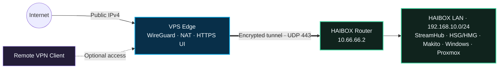

# HAIBOX WireGuard

Secure remote access and public service delivery for portable HAIBOX systems through a WireGuard-enabled VPS.

[](https://github.com/simonemessina92/haibox-wireguard/releases/latest)
[](#requirements)
[](https://www.wireguard.com/)

HAIBOX WireGuard turns a public Debian or Ubuntu VPS into the secure network edge for a HAIBOX deployment. It connects the HAIBOX router to the VPS, provides Internet breakout through the VPS public IPv4, publishes selected services and offers an HTTPS control panel for configuration and monitoring.

## Get the latest Golden

Install the latest stable release on a clean VPS as `root`:

```bash
bash <(curl -fsSL https://raw.githubusercontent.com/simonemessina92/haibox-wireguard/main/install.sh)
```

[Download v6.4 script](https://github.com/simonemessina92/haibox-wireguard/releases/download/v6.4/haibox-wireguard_v6.4.sh) · [SHA-256 checksum](https://github.com/simonemessina92/haibox-wireguard/releases/download/v6.4/haibox-wireguard_v6.4.sh.sha256) · [Release notes](https://github.com/simonemessina92/haibox-wireguard/releases/tag/v6.4)

## Architecture



The VPS handles the public edge, routing and controlled port forwarding. The HAIBOX router maintains the encrypted tunnel and routes the local `192.168.10.0/24` network without requiring inbound connectivity at the venue.

## Golden v6.4

- Automated WireGuard server deployment and HAIBOX router configuration
- Full-tunnel Internet breakout through the VPS public IPv4
- Public DNAT and HAIBOX-side hairpin access for configured services
- Persistent routing, NAT and firewall rules
- Optional Remote VPN Client configuration
- Authenticated HTTPS control panel on TCP `65000`
- Live WireGuard peer, traffic and HAIBOX LAN service monitoring
- Network statistics and system health diagnostics
- Sanitized support bundle for troubleshooting
- Build identity, release channel and installed-script SHA-256
- Automatic first-login setup with mandatory password replacement

The networking behavior in v6.4 is based on the physically tested Golden baseline and has been validated on the HAIBOX test environment before release.

## Stable installation

### Requirements

- A clean Debian or Ubuntu VPS
- A public IPv4 address
- Root access
- UDP `443` available for WireGuard
- TCP `65000` available for the management interface

After running the installer shown above, select `INSTALL + WEB UI`, then open:

```text
https://VPS_PUBLIC_IP:65000
```

Initial credentials:

```text
Username: admin
Password: password
```

A new password is required before the control panel becomes available. The stable installer always downloads the script associated with the latest published Golden release; the matching checksum is available with the release assets.

## Default network layout

| Component | Default address |
|---|---:|
| HAIBOX Router | `192.168.10.1` |
| StreamHub | `192.168.10.101` |
| HSG/HMG | `192.168.10.102` |
| Makito X4E | `192.168.10.103` |
| Windows Orchestrator | `192.168.10.104` |
| Proxmox | `192.168.10.250` |
| VPS WireGuard | `10.66.66.1` |
| HAIBOX Router WireGuard | `10.66.66.2` |
| Remote VPN Client | `10.66.66.3` |

Addresses, service ports and forwarding rules can be adjusted from the Web UI before applying the configuration.

## Development builds

The `main` branch contains the latest Golden release. New work is validated on `develop` and can be installed only on a dedicated test environment with:

```bash
bash <(curl -fsSL https://raw.githubusercontent.com/simonemessina92/haibox-wireguard/develop/install-dev.sh)
```

Development builds may change an active VPS configuration and should not be used as production releases. See [`DEVELOPMENT_BASELINE.md`](DEVELOPMENT_BASELINE.md) for engineering constraints and regression checks, and [`CHANGELOG.md`](CHANGELOG.md) for release history.

## Releases and integrity

Each Golden release includes:

- A versioned installation script
- A SHA-256 checksum file
- Release notes describing the validated changes

Previous Golden versions remain available from [GitHub Releases](https://github.com/simonemessina92/haibox-wireguard/releases).

## Project

Designed and developed by **Simone Messina**.

This software is provided as-is, without warranty. Review the configuration and exposed services before using it on production systems.
